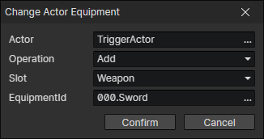

# Change Actor Equipment

- Actor：Actor getter
- Operation
  - Add：Create an equipment and add it to the actor (if an equipment exists in the slot, remove it first)
  - Remove：Remove an equipment
  - Add Instance：Read an equipment from the equipment getter and add it to the actor
  - Remove Instance：Read an equipment from the equipment getter and remove it from the actor
  - Remove Slot：Remove an equipment by specifying an equipment slot

:::tip

Equipment slots can be customized in the "enumeration window" [F7].

:::