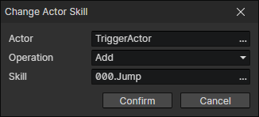

# Change Actor Skill

- Actor：Actor getter
- Operation
  - Add：Create a skill and add it to the actor (if the same skill already exists, skip)
  - Remove：Remove a skill
  - Remove Instance：Read a skill from the skill getter and remove it from the actor
  - Sort by Filename：Sort all skills of the actor by file name (can be executed once when the actor learns a new skill)