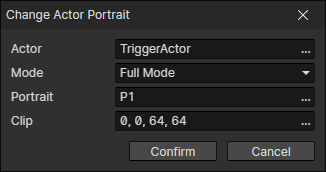

# Change Actor Portrait

- Actor：Actor getter
- Mode
- Full Mode：Enable parameters (Portrait, Clip)
- Image Mode：Enable parameter (Portrait)
- Clip Mode：Enable parameter (Clip)

:::tip

You can put different actor's avatars into an image and switch actors by changing the cropping area.  
Or you can put different expression avatars of one actor into an image, and switch the actor by changing the image, and switch the expression by changing the cropping area.

:::