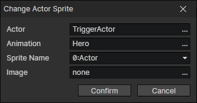

# Change Actor Sprite

- Actor：Actor file
- Animation：Animation file
- Sprite Name：A spritesheet
- Image：Replace the specified spritesheet with a new one

:::tip

You can change the spritesheet in the actor animation (paper doll system)  
When putting on equipment, you can set the corresponding equipment spritesheet

:::