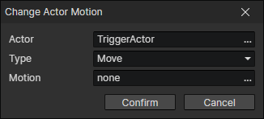

# Change Actor Motion

- Actor：Actor getter
- Type
  - Idle：Change the "idle" motion of the actor animation
  - Move：Change the "move" motion of the actor animation
- Motion：New Motion

:::tip

When an actor enter a turn-based battle, you can change to another set of "idle" and "move" motions, and change back after the battle is over.

:::tip