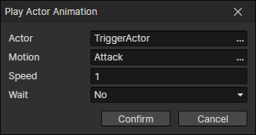

# Play Actor Animation

- Actor：Actor getter
- Motion：Play a motion of the actor animation and revert to "idle" or "move" motion when the playback is over
- Speed：You can input the "Attack Speed" attribute of the actor
- Wait：Wait for the end of playback and execute the subsequent commands

:::tip

When playing a looping animation, it will not end automatically. Call the "Stop Actor Animation" command to end the playback.

:::