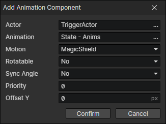

# Add Animation Component

- Actor：Actor getter
- Animation：Animation File
- Motion：A motion of the animation (Animation + Motion = Anim Component ID)
- Rotatable：When on, animation rotation is affected by angle
- Sync Angle：When turned on, the animation angle is automatically set to the actor angle
- Priority：The priority of this animation layer
  - Less than 0：The animation component is displayed below the actor animation
  - Greater than or equal to 0：The animation component is displayed at the top of the actor animation
- Offset Y：The vertical offset distance (in pixels) of the animation rendering position.

:::tip

Example: After the actor adds the "magic shield" state, add the related animation component, and when the "magic shield" state disappears, remove the related animation component.

:::