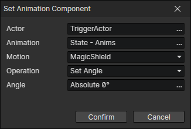

# Set Animation Component

- Actor：Actor getter
- Animation：Animation File
- Motion：A motion of the animation (Animation + Motion = Anim Component ID)
- Operation
  - Set Angle
  - Set Scale
  - Set Speed
  - Set Opacity
  - Set Priority
  - Set Offset Y
  - Set Sprite
  - Play Motion
    - Wait：Wait for the end of playback and execute the subsequent commands
  - Stop Motion
