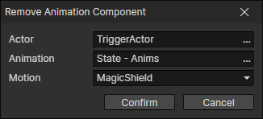

# Remove Animation Component

Remove the component with the specified animation and motion from the list of character animation components.

- Actor：Actor getter
- Animation：Animation File
- Motion：A motion of the animation (Animation + Motion = Anim Component ID)