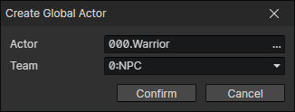

# Create Global Actor

Create a global actor corresponding to the specified actor file.  
Once created, the data of the global actor will be saved in the game archive.  
The created global actor can be accessed later through the actor file.

- Actor：Actor getter
- Team: The new actor's team

:::tip

It is possible to take advantage of the fact that the data of a global actor is saved to design features such as  
Let the store owner share an global actor's inventory via the "Set Inventory" command. A random store inventory system could be implemented by adding some random equipments into this inventory every once in a while.  
Or have a global actor's inventory that acts as the player's store.

The initial party members will be automatically created as global actors during game initialization. (Check in the "Project Settings" Window)

:::