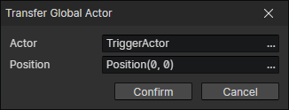

# Transfer Global Actor

Transfer a global actor to the specified location in the current scene. If the actor already exists, the command will not take effect.

- Actor：Global actor getter
- Position：Position getter