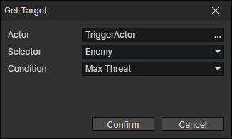

# Get Target

Takes an actor from the target pool of the specified actor and sets him to the "Target Actor" of the actor getter.

- Actor：Actor getter
- Selector：Filter actors by relationship
  - Enemy
  - Friend
  - Team Member
  - Team Member Except Self
  - Any Except Self
  - Any
- Condition
  - Max Threat：The actor who poses the greatest threat to this actor
  - Nearest：The actor who is closest to this actor
  - Farthest：The actor who is furthest away from this actor
  - Min Attribute Value：The actor with the minimum value of the specified attribute, enable parameter (Attribute).
  - Max Attribute Value：The actor with the maximum value of the specified attribute, enable parameter (Attribute).
  - Min Attribute Ratio：The actor with the minimum ratio of two attribute values, enabled parameters (Attribute, Attribute 2)
  - Max Attribute Ratio：The actor with the maximum ratio of two attribute values, enabled parameters (Attribute, Attribute 2)
  - Random：Select a random actor