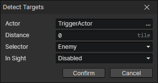

# Detect Targets

Search nearby actors and add them to the target pool.

- Actor：Actor getter
- Distance：Get a circular range of actors to add to the target pool
- Selector：Filter actors by relationship
  - Enemy
  - Friend
  - Team Member
  - Team Member Except Self
  - Any Except Self
  - Any
- In Sight：When enabled, if there is wall terrain between this actor and the target that obscures the view, the target will be dropped.