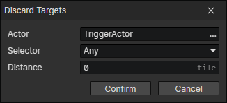

# Discard Targets

- Actor：Actor getter
- Selector：Filter actors by relationship
  - Enemy
  - Friend
  - Team Member
  - Team Member Except Self
  - Any Except Self
  - Any
- Distance：Discard all actors in the target pool that are greater than or equal to the specified distance.

:::tip

Usually used to achieve the function of disengaging from the battle, when the player shakes off the monster, the monster will give up the pursuit and return to the birth point.

:::