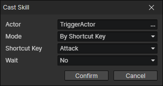

# Cast Skill

Trigger the "Cast Skill" event, if the skill does not exist or the cooldown is not finished, the command will not be executed.

- Actor：Actor getter
- Mode
  - By Shortcut Key：Get the skill in the shortcut bar of the specified actor, enable parameters (Actor, Shortcut Key)
  - By Skill ID：Get the skill corresponding to the skill file ID of the specified actor, enable parameters (Actor, Skill File)
  - By Skill Instance：Read a skill from the skill getter
- Wait：When enabled, wait for the skill event to finish executing and continue executing the subsequent commands