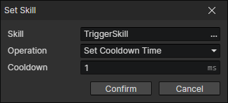

# Set Skill

Set the cooldown of the skill. Usually use this command in the "Cast Skill" event to set the cooldown.

- Skill：Skill getter
- Operation
  - Set Cooldown Time
  - Increase Cooldown Time
  - Decrease Cooldown Time
- Cooldown Time