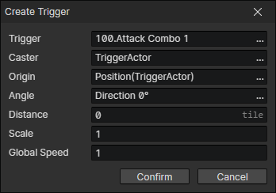

# Create Trigger

In "Cast Skill" events, it is often necessary to create a trigger to achieve skill damage.  
The "Hit Actor" event is called when the trigger collides with a target actor.  
It uses a polar coordinate system to determine the position: from the initial position here, rotate a certain angle and advance a certain distance as the trigger creation position.  
The global speed can be set to the actor's attack speed.

- Trigger：Trigger File
- Caster：You can get this actor by "Skill caster" in trigger events
- Origin：Original reference position
- Angle：Initial angle of the trigger
- Distance：The distance the trigger is shifted forward from the original position and the initial angle, which determines the initial position
- Scale：Overall scaling triggers shapes and animations, which can be used as attack ranges.
- Global Speed：Overall affects the speed of the trigger, which can be used as an attack speed.