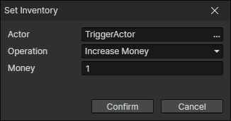

# Set Inventory

- Actor：Actor getter
- Operation
  - Increase Money
  - Decrease Money
  - Increase Items
  - Decrease Items
  - Gain Equipment：Create an equipment and add it to the inventory
  - Lose Equipment：Remove an equipment from the inventory
  - Gain Equipment Instance：Read an equipment from the equipment getter and add it to the inventory
  - Lose Equipment Instance：Read an equipment from the equipment getter and remove it from the inventory
  - Swap Order of Items：Swap the position of two items in the inventory
  - Sort Simply：Eliminate spaces between items, but does not change the order of items
  - Sort by Filename：Eliminate the spaces between items while changing the order of items
  - Use Global Actor's Inventory：Make the inventory of the specified global actor as the inventory of this actor (shared)
  - Restore Inventory：Restore the actor's own inventory
  - Reset：Clear items and money from the inventory