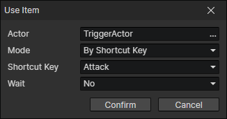

# Use Item

Trigger the "Use Item" event.

- Actor：Actor getter
- Mode
  - By Shortcut Key：Get the item in the shortcut bar of the specified actor, enable parameters (Actor, Shortcut Key)
  - By Item ID：Get the item corresponding to the item file ID of the specified actor, enable parameters (Actor, Item File)
  - By Item Instance：Read an item from the item getter
- Wait：When enabled, wait for the item event to finish executing and continue executing the subsequent commands