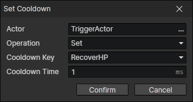

# Set Cooldown

Set the cooldown time corresponding to the cooldown key and it will run automatically in the background  
You can get the cooldown time and progress by "Set Number" command

- Actor：Actor getter
- Operation
  - Set
  - Increase
  - Decrease
- Cooldown Key
- Cooldown Time

:::tip

Items of the same class can use the same cooldown key, such as Healing Potion, Healing Potion Plus, and Healing Potion Ultra.  
The cooldown keys can be customized in the "enumeration window" [F7].

:::