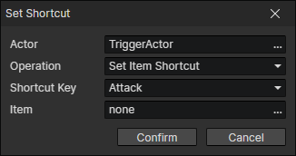

# Set Shortcut

Add an item or skill to the shortcut bar, or delete the specified shortcut item.

- Actor：Actor getter
- Operation
  - Set Item Shortcut：Set the item with the specified ID to the shortcut bar
  - Set Skill Shortcut：Set the skill with the specified ID to the shortcut bar
  - Delete Shortcut：Delete the item or skill corresponding to the key from the shortcut bar
  - Swap Shortcuts：Swap items or skills corresponding to two keys in the shortcut bar

:::tip

Shortcut keys can be customized in the "enumeration window" [F7].

:::