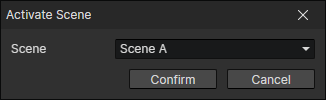

# Activate Scene

It is possible to switch between primary and secondary scenes. The inactive scene is paused (not reset) and can be continued after switching back.

- Scene
  - Scene A
  - Scene B

:::tip

Switch to the secondary scene when you enter a turn-based battle, and switch back to the primary scene when the battle is over.

:::