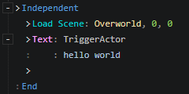

# Load Scene

Destroy the current scene and load a new one.

- Scene：Scene File
- Transfer Player
  - Yes：After the scene is loaded, transfer the "Player Actor" to the specified location
  - No

:::tip

If the player actor enters a region and triggers an event, then loads a new scene, as the current scene is destroyed, the event's host "region" is also destroyed, which may make it impossible to continue executing the next commands, so you can put the "Load Scene" and the subsequent commands into the "Independent" command block.

:::