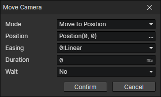

# Move Camera

- Mode
  - Move to Position
  - Follow Actor：Lock the camera to the location of the target actor
- Easing
- Duration
- Wait：Wait for the end of the transition and continue to execute the subsequent commands