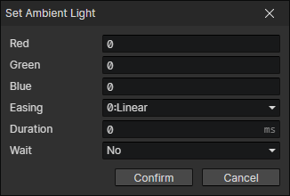

# Set Ambient Light

- Red：0 ~ 255
- Green：0 ~ 255
- Blue：0 ~ 255
- Easing
- Duration
- Wait：Wait for the end of the transition and continue to execute the subsequent commands

:::tip

Ambient light can be set by variables for day/night systems

:::