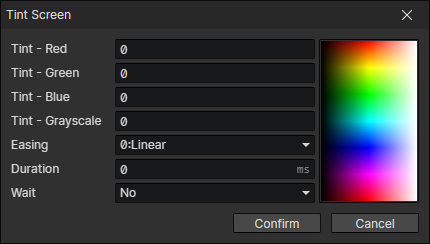

# Tint Screen

It can be used for scene transitions.

- Tint - Red：-255 ~ 255
- Tint - Green：-255 ~ 255
- Tint - Blue：-255 ~ 255
- Tint - Grayscale：0 ~ 255
- Easing
- Duration
- Wait：Wait for the end of the transition and continue to execute the subsequent commands