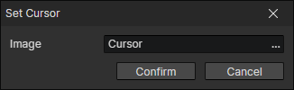

# Set Cursor

- Image：Image file of the mouse pointer

:::tip

It can be set to a specific mouse pointer when the mouse enters the element and revert to the default pointer when it leaves the element.

:::