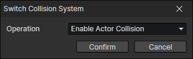

# Switch Collision System

Switch the built-in actor collision or scene collision system.

- Operation
  - Enable Actor Collision
  - Disable Actor Collision
  - Enable Scene Collision
  - Disable Scene Collision