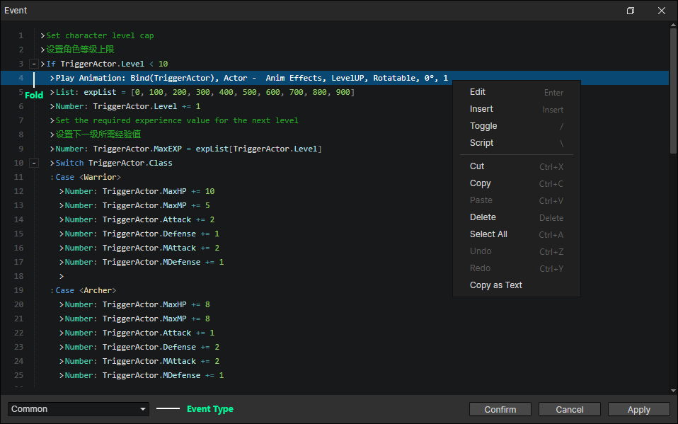
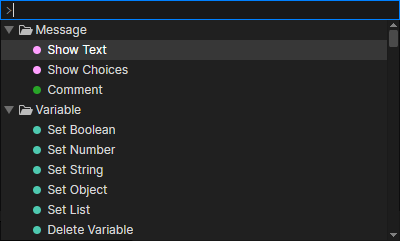

# Event Window

- Event Type
  - Common：Not automatically executed, triggered via the "call event" command.
  - Special：Triggered by specific actions in the game, such as mouse down, key down, autorun, etc.
  - Custom：Custom events are added via the "enumeration" window and need to be called via the "Call Event" command.
- Hotkey
  - Up：Select Up
  - Down：Select Down
  - PageUp：Page up and select the command
  - PageDown：Page down and select the command
  - Ctrl + PageUp：Page up
  - Ctrl + PageDown：Page down
  - Home：Scroll to the top and select the command
  - End：Scroll to the bottom and select the command
  - Ctrl + Home：Scroll to the top
  - Ctrl + End：Scroll to the bottom

### Context Menu

- Edit：Edit the selected command
- Insert：Insert a new command before the selected command
- Toggle：Enable / disable the selected command, if disabled, it will not take effect when running the game
- Script：Insert Javascript in the selected location, which can be used for debugging. For example, insert the script to output local variables: console.log(Event.attribute), and press F12 in the game to open the console
- Copy as Text：Copy the selected commands into text format for communication and learning purposes.

### Command Input

In the command list, search for event commands by pressing A-Z, the space bar, and the insert key, and then press Enter to insert the selected command.  
When the mouse hovers over the command list below the input box, it prompts for a search keyword, and you can search for event commands by keyword or name.

- Hotkey
  - Up：Select up
  - Down：Select down
  - PageUp：Page up and select the command
  - PageDown：Page down and select the command
  - Escape：Close the command input box