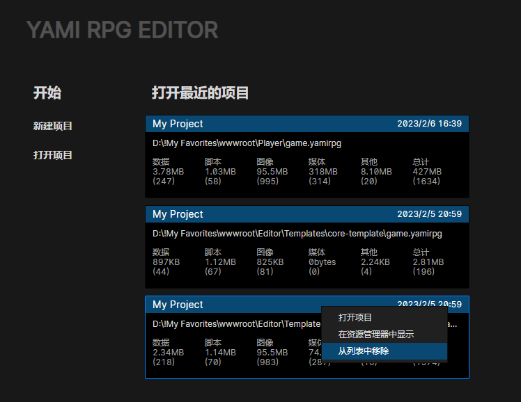
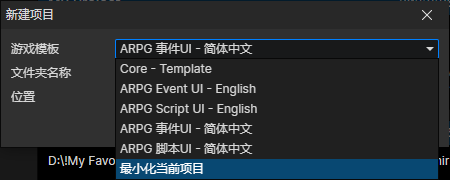

# 启动页面

### 最近的项目

可以通过右键菜单移除历史项目

### 新建项目

- 游戏模板
  - Core - Template：只保留一些必要内容的模板
  - ARPG 事件UI：UI交互由事件指令实现的ARPG模板
  - ARPG 脚本UI：UI交互由Javascript脚本实现的ARPG模板
  - 最小化当前项目：将当前打开的项目，导出到另一个位置，同时去掉未用到的文件
