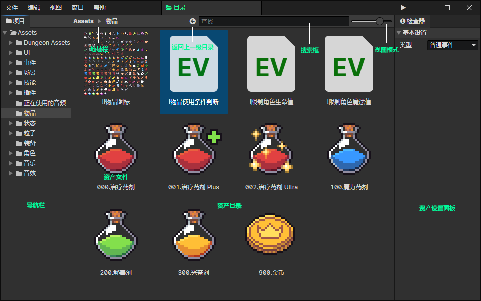

# 文件浏览器

- 导航栏：可快速在几个文件夹之间切换
- 地址栏：可以返回上一级目录
- 搜索框：搜索文件可以输入文件扩展名查找同一类型的所有文件(比如：物品的扩展名是.item)，可以通过选中文件->右键菜单->在资源管理器中显示，查看文件扩展名。另外，在搜索框中输入.可以搜索全部可用文件，这个技巧在选择固定类型的文件时很常用，比如选择角色文件时，输入.就可以显示所有角色。
- 视图模式：100%画面缩放率的情况下，从左到右分别是16px列表、32px平铺、64px平铺、128px平铺、256px平铺五个视图模式。
- 资产目录：按下Ctrl+鼠标左键可以多选或反选文件，按下Shift+鼠标左键可以选中连续的多个文件，在<资产目录>中按下"鼠标后退键"或"Backspace"可以返回上一级目录。

:::tip

在编辑器文件浏览器中，可以随意修改文件的名称和路径，而不会造成资产文件路径错误，这是因为：每个文件名中都包含了一个GUID(16个字符)，但是在编辑器中会隐藏文件名中的GUID，可以在资源管理器中查看到GUID

如果有多个文件使用了同样的GUID会怎么样？  
在编辑器中只显示一个文件，其他GUID重复的文件会被隐藏。将会在以后的更新中实现：提醒用户哪些文件的GUID发生了冲突。

:::