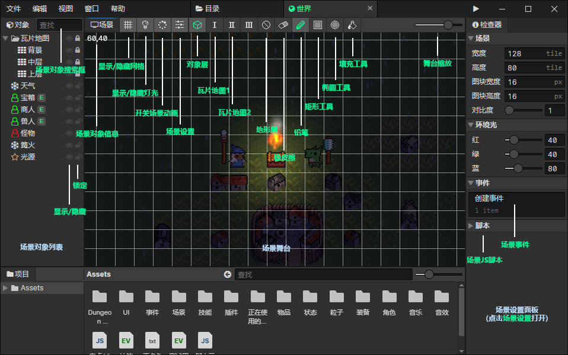

# 场景

### 场景对象列表

- 场景对象搜索框：输入关键字搜索场景对象，按Escape清空搜索内容，在列表中按下"鼠标后退键"或"Backspace"效果也一样
- 显示/隐藏对象：可以隐藏不想看到的场景对象
- 锁定对象：被锁定的场景对象不可选中，可以将瓦片地图、视差图等大型对象锁定，避免误操作

### 场景舞台

- 场景对象信息：显示选中的场景对象的信息，或者鼠标所在位置的坐标
- 显示/隐藏网格：开启时，绘制**场景宽度** \* **场景高度**的网格线，网格大小 = **图块宽度** \* **图块高度**
- 显示/隐藏灯光：开启时，渲染**环境光**和**光源对象**
- 开关场景动画：开启时，播放**动画**和**粒子**
- 场景设置：打开右边的**场景设置面板**
- 对象层：可以选中场景对象
- 瓦片地图1：编辑绑定了快捷键1的瓦片地图
- 瓦片地图2：编辑绑定了快捷键2的瓦片地图
- 地形层：设置场景图块的通行
  - 地面：通行区域为"地面"或"不受限制"的角色可以在这里移动
  - 水面：通行区域为"水面"或"不受限制"的角色可以在这里移动
  - 墙块：通行区域为"不受限制"的角色可以在这里移动，可以阻挡"触发器"(子弹)对象穿过
- 橡皮擦：擦除正在编辑的瓦片地图中的图块
- 铅笔：绘制一个图块到正在编辑的瓦片地图中
- 矩形工具：编辑瓦片地图时，通过拖拽可以将图块批量绘制到矩形区域中
- 椭圆工具：编辑瓦片地图时，通过拖拽可以将图块批量绘制到椭圆区域中
- 填充工具：编辑瓦片地图时，将一个图块周围所有相邻的相同图块替换成指定图块
- 舞台缩放：从左到右分别是25%、50%、100%、200%、400%五个缩放级别

### 场景设置面板

- [点击跳转](/docs/inspectors/scene/scene-settings)