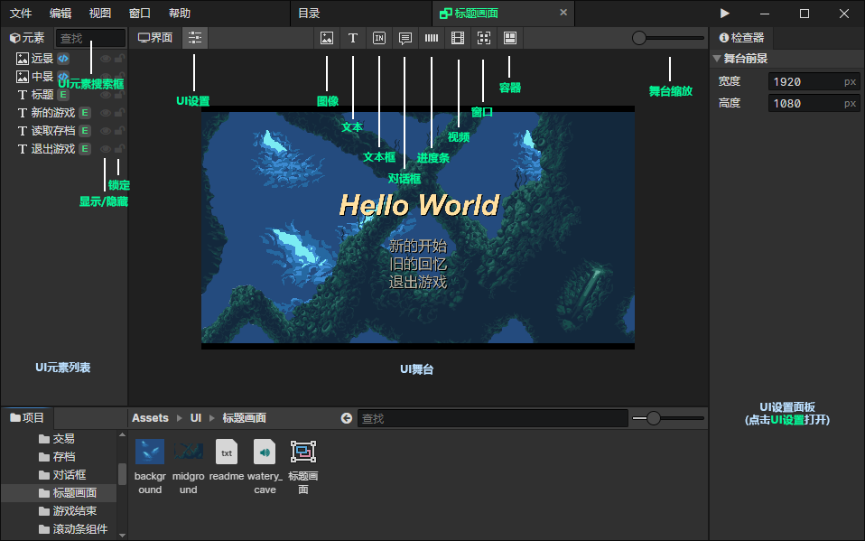

# UI

### UI元素列表

- UI元素搜索框：输入关键字搜索UI元素，按Escape清空搜索内容，在列表中按下"鼠标后退键"或"Backspace"效果也一样
- 显示/隐藏元素：可以隐藏不想看到的UI元素
- 锁定元素：被锁定的UI元素不可选中，避免误操作

### UI舞台

- UI设置：打开右边的**UI设置面板**
- 图像：显示图像文件的元素
- 文本：支持富文本标签
- 文本框：可以让用户输入文本的元素
- 对话框：可以逐字打印文本的元素
- 进度条：可视化0 ~ 1的进度
- 视频：播放视频文件
- 窗口：支持对窗口子元素使用网格布局
- 容器：用来嵌套其他元素
- 舞台缩放：从左到右分别是25%、50%、100%、200%、400%五个缩放级别

### UI设置面板

- [点击跳转](/docs/inspectors/ui/ui-settings)