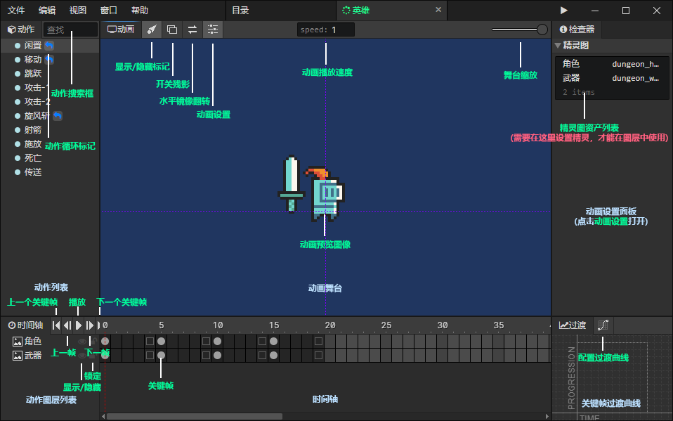

# 动画

### 动作列表

- 动作搜索框：输入关键字搜索动作，按Escape清空搜索内容，在列表中按下"鼠标后退键"或"Backspace"效果也一样

### 动画舞台

- 显示/隐藏标记：显示或隐藏关节、粒子等标记图案
- 开关残影：开启时显示当前帧的上一帧和下一帧的半透明精灵图
- 水平镜像翻转：以Y轴为对称轴，水平翻转舞台中的动画
- 动画设置：打开右边的**动画设置面板**
- 动画播放速度：预览时的动画播放速度，可以降低速度查看细节，运行游戏时不受影响
- 舞台缩放：从左到右分别是25%、50%、100%、200%、400%五个缩放级别

### 动画设置面板

- [点击跳转](/docs/inspectors/animation/animation-settings)

### 动作图层列表

- 显示/隐藏图层：可以隐藏不想看到的动画图层
- 锁定图层：被锁定的图层中的关键帧不可选中，避免误操作

### 时间轴

- 上一个关键帧：跳转到当前帧的上一个关键帧
- 下一个关键帧：跳转到当前帧的下一个关键帧
- 上一帧：跳转到当前帧的上一帧
- 下一帧：跳转到当前帧的下一帧
- 播放/暂停：如果动画暂停中，播放动画，否则暂停播放
- 关键帧：选中后可以设置动画帧参数

### 关键帧过度曲线

- 配置过渡曲线：打开"过渡设置"窗口