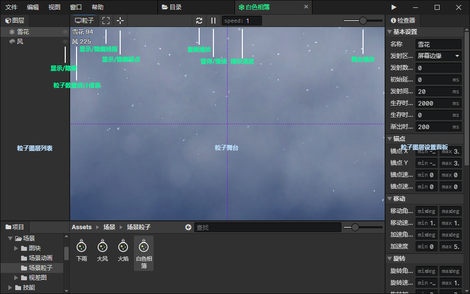

# 粒子

### 粒子图层列表

- 显示/隐藏图层：可以隐藏不想看到的粒子图层

### 粒子舞台

- 粒子数量统计信息：实时显示舞台中每个图层有多少个粒子
- 显示/隐藏线框：开启时，渲染粒子元素的矩形线框
- 显示/隐藏锚点：开启时，渲染粒子元素的锚点(红十字)，以及锚点到粒子中心的连线(绿色线条)
- 暂停/继续：暂停舞台中的粒子，再次点击继续播放
- 播放速度：预览时的粒子播放速度，可以降低速度查看细节，运行游戏时不受影响
- 舞台缩放：从左到右分别是25%、50%、100%、200%、400%五个缩放级别

### 粒子图层设置面板

- [点击跳转](/docs/inspectors/particle/particle-layer)