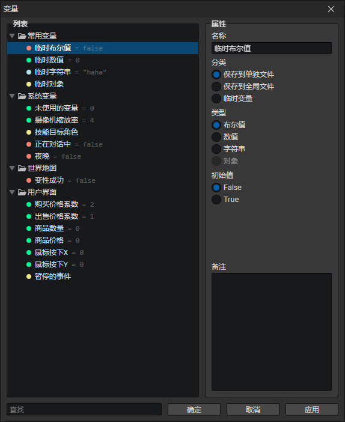

# 窗口 - 全局变量

### 变量列表

可以在此创建文件夹和变量，每个变量拥有一个独一无二的ID，可打开右键菜单查看或复制ID
- 搜索框：查找关键字匹配的变量，选中查找结果后，可以在列表中按下"鼠标后退键"清空搜索内容

### 属性

- 名称：变量在编辑器中显示的名称
- 分类
  - 保存到单独文件：变量数据在保存游戏时写入存档
  - 保存到全局文件：变量数据在退出游戏时写入全局存档，在启动游戏时自动读取全局存档，也就是所谓的二周目变量
  - 临时变量：变量数据不会被保存，重置游戏时恢复初始值，启用变量类型(对象)
- 类型
  - 布尔值：可以写入简单的两种状态：true和false
  - 数值：支持整数和小数，也可以用来写入多个状态，比如0，1，2，3...分别代表一个任务的不同阶段
  - 字符串：可以写入名字，也可以用来写入多个状态，用文字作为状态更容易理解，比如"open"，"closed"
  - 对象：对象可以是角色、技能、物品、装备、元素、列表等，由于对象无法保存，所以只能写入到临时变量中
- 初始值：根据变量类型，呈现不同的输入框
- 备注：可以把该变量的作用记录下来，或者是一共有哪些状态值，避免遗忘