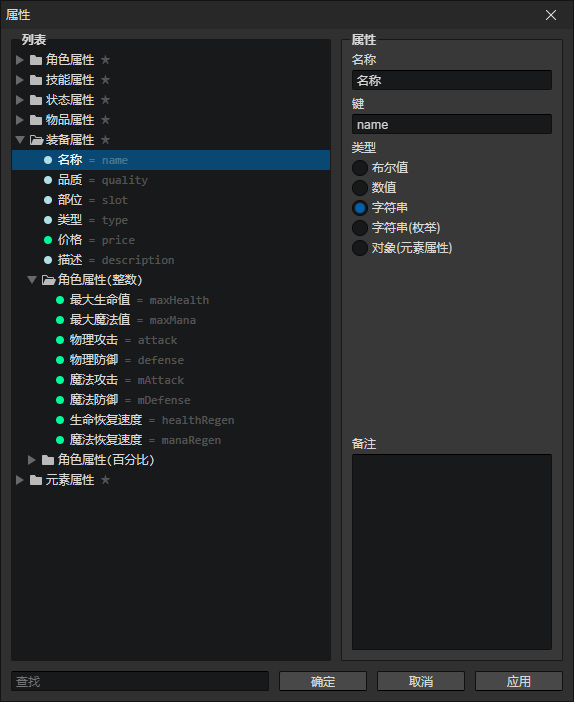
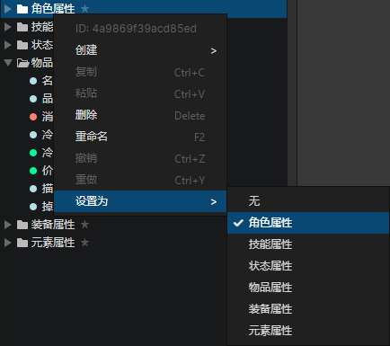
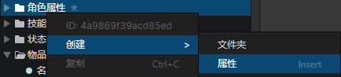

# 窗口 - 对象属性

### 属性列表

可以在此创建文件夹和属性，每个文件夹和属性拥有一个独一无二的ID，可打开右键菜单查看或复制ID

- 搜索框：查找关键字匹配的属性，选中查找结果后，可以在列表中按下"鼠标后退键"清空搜索内容

### 属性

- 名称：属性在编辑器中显示的名称
- 键：属性在程序中实际的名称，可通过脚本访问，如果不填写则会使用属性ID作为键
- 类型
  - 布尔值：可以写入简单的两种状态：true和false
  - 数值：支持整数和小数
  - 字符串：可以写入名字、描述等内容
  - 字符串(枚举)：可以指定一个枚举文件夹，作为字符串选项群组，方便统一修改字符串的值
  - 对象(元素属性)：对象可以是角色、技能、物品、装备、元素、列表等，由于对象无法保存，所以只能作为元素属性写入到临时变量中
- 备注：可以把该属性的作用记录下来，避免遗忘

### 上下文菜单 - 设置为对象属性

选中一个文件夹，打开右键菜单->设置为，可以把这个文件夹(包括子文件夹)的属性设置为指定对象类型的属性列表  
比如设置为角色属性，就可以在角色面板的属性列表中添加这个文件夹中的所有属性

### 上下文菜单 - 创建属性

可以通过右键菜单->创建->属性来添加新的自定义属性