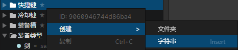

# 窗口 - 枚举字符串

### 枚举列表

可以在此创建文件夹和枚举字符串，每个文件夹和枚举字符串拥有一个独一无二的ID，可打开右键菜单查看或复制ID

- 搜索框：查找关键字匹配的枚举，选中查找结果后，可以在列表中按下"鼠标后退键"清空搜索内容

### 属性

- 名称：枚举在编辑器中显示的名称
- 值：枚举在程序中的值，可通过脚本访问，如果不填写则会使用枚举ID作为值
- 备注：可以把该文件夹或枚举字符串的作用记录下来，避免遗忘

### 上下文菜单 - 设置为特殊用途

选中一个文件夹，打开右键菜单->设置为，可以把这个文件夹(包括子文件夹)的枚举设置为自定义事件等各种用途  
比如设置为角色事件，角色就可以使用这个文件夹中的所有自定义事件，自定义事件可以通过<调用事件>指令来执行，也可以在插件中调用

### 上下文菜单 - 创建枚举字符串

可以通过右键菜单->创建->字符串来添加新的枚举