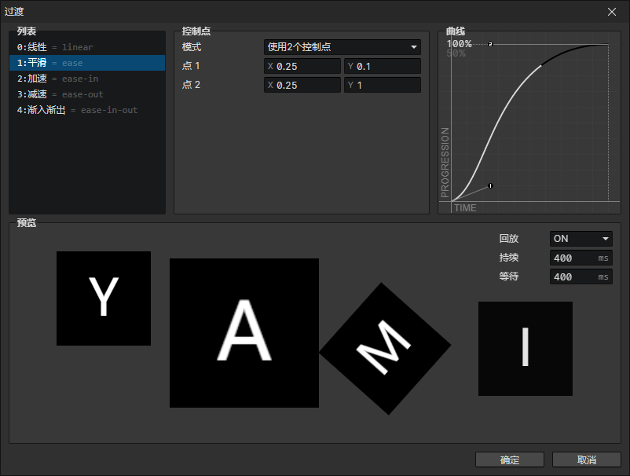

# 窗口 - 过渡

### 过渡列表

可以通过右键菜单插入新的过渡曲线，给过渡曲线设置键( = linear)，可以在脚本中通过键来获取过渡曲线  
过渡曲线可以随意调换顺序，可以把常用曲线设为第一个，这会在一些输入框中被默认选择

### 控制点

- 模式：可选2/5/8个控制点
- 控制点：通过设置控制点的(X, Y)坐标来调整过渡曲线

### 曲线

X轴代表时间(0 ~ 1)，Y轴代表进度(0 ~ 1)，可以通过改变曲线的形状来控制物体在一定时间内运动的快慢  
点击左上角的100%/50%可以改变缩放比例

### 预览

- 回放：开启时，播放结束后反向播放
- 持续：一次过渡的持续时间
- 等待：过渡结束后的等待时间
