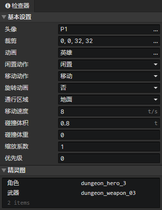
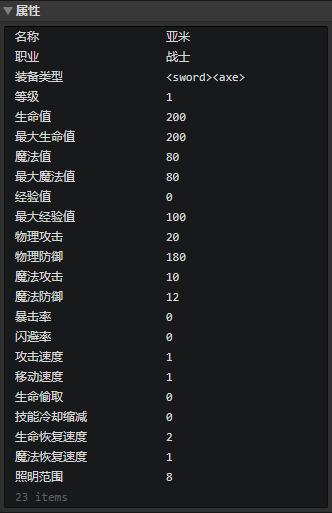
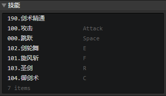
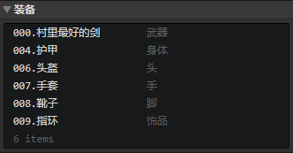
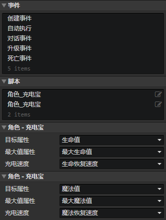

# 文件 - 角色

### 基本设置

- 头像：角色头像，使用<加载图像>指令加载到图像元素中，使用<改变角色头像>指令修改
- 裁剪：如果将角色的不同表情或多个角色头像放入一张图中，可以裁剪指定的矩形区域部分，使用<改变角色头像>指令修改
- 动画：角色动画，使用<改变角色动画>指令修改
- 闲置动作：角色处于闲置状态时，自动播放的动画动作，使用<改变角色动作>指令修改
- 移动动作：角色处于移动状态时，自动播放的动画动作，使用<改变角色动作>指令修改
- 旋转动画：开启时，动画旋转角度会自动设置成角色当前的角度，可用于顶视图游戏
- 通行区域
  - 地面：角色只能在地面移动
  - 水面：角色只能在水面移动
  - 不受限制：角色可在地面、水面、墙块中移动
- 移动速度：角色的初始移动速度(单位：图块/秒)，使用<设置移动速度>指令修改
- 碰撞体积：用于角色与角色之间碰撞的正方形边长(单位：图块)
- 碰撞体重：角色碰撞相关属性，使用<设置体重>指令修改
  - 体重 = 0时，忽略该角色的碰撞
  - 角色A的体重 : 角色B的体重 = 1 : 1时，A推B的移动速度变成50%
  - 角色A的体重 : 角色B的体重 = 1 : 2时，A推B的移动速度为0%，推不动
  - 角色A的体重 : 角色B的体重 = 2 : 1时，A推B的移动速度为100%，完全没有阻力
  - 可以将NPC的体重设置为最大值8，无法被其他人推动
- 缩放系数：整体缩放<角色动画>
- 优先级：角色动画在渲染时的排序优先级，位置在下方的动画总是会遮挡上方的动画
  - 优先级 = -1，表示排序位置向上偏移一个图块的距离，如果把角色是地刺，需要降低优先级
  - 优先级 = 1，表示排序位置向下偏移一个图块的距离，如果角色是飞行的，需要提升优先级

### 精灵图

可替换角色动画的精灵图，比如替换头发、衣服、武器等，实现纸娃娃换装功能。也就是说，多名角色可共享一个角色动画。

### 角色属性列表

支持布尔值、数值、字符串、字符串(枚举)类型。在窗口->对象属性中修改自定义属性。  
使用<设置布尔值><设置数值><设置字符串>指令读取或修改角色属性。

### 角色技能列表

设置角色的初始技能和快捷键。在窗口->枚举中设置快捷键。  
使用<改变角色技能><施放技能>等相关指令。

### 角色装备列表

设置角色的初始装备和装备槽部位，装备槽数量不受限制，可在窗口->枚举中设置。

### 角色事件列表

在事件中访问<事件触发角色>获取本角色

- 创建事件：角色初始化时执行的事件(执行一次)
- 自动执行：角色出现在场景时自动执行，包括读取存档后
- 碰撞事件：角色与角色发生碰撞时执行，体重如果为0，就不会发生碰撞。在事件中访问<目标角色>获取与本角色碰撞的角色
- 击中触发器：角色被一个触发器击中时，执行本事件，在事件中访问<事件触发器>获取与本角色碰撞的触发器
- 自定义事件：可通过<调用事件>指令调用自定义事件

### 角色脚本列表

添加Javascript文件来扩展角色