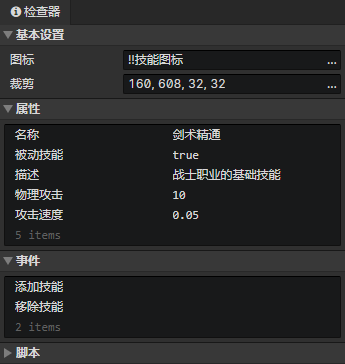

# 文件 - 技能

### 基本设置

- 图标：技能图标，使用<加载图像>指令加载到图像元素中
- 裁剪：可以裁剪技能图标中指定的矩形区域部分

### 技能属性列表

支持布尔值、数值、字符串、字符串(枚举)类型。在窗口->对象属性中修改自定义属性。  
使用<设置布尔值><设置数值><设置字符串>指令读取或修改技能属性。

### 技能事件列表

在事件中访问<事件触发角色>获取技能施放角色  
在事件中访问<事件触发技能>获取本技能

- 施放技能：调用<施放技能>指令时触发事件
- 添加技能：当角色通过<改变角色技能>指令添加本技能时触发事件
- 移除技能：当角色通过<改变角色技能>指令移除本技能时触发事件
- 自定义事件：可通过<调用事件>指令调用自定义事件

### 技能脚本列表

添加Javascript文件来扩展技能