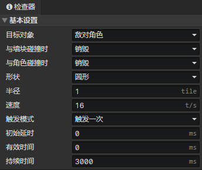
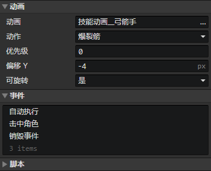

# 文件 - 触发器

### 基本设置

- 目标对象：与触发器发生碰撞的角色对象，碰撞时触发<击中角色>事件
  - 敌对角色：与技能施放角色敌对的角色
  - 友好角色：与技能施放角色友好的角色
  - 队伍成员：技能施放角色所在队伍的成员
  - 除自己外的队伍成员：技能施放角色所在队伍的成员，但不包括技能施放角色
  - 除自己外的任意角色：除技能施放角色以外的任意角色
  - 任意角色
- 与墙块碰撞时
  - 穿透：无视墙块地形的阻挡
  - 销毁：当触发器的锚点进入墙块内部时，销毁触发器
- 与角色碰撞时
  - 穿透：触发器击中角色时，不受影响
  - 销毁：触发器击中角色时，销毁触发器
  - 多次命中后销毁：触发器击中角色一定次数后，销毁触发器，启用参数(击中次数)
    - 击中次数：最大的允许穿透次数
- 形状
  - 矩形：启用参数(宽度，高度，锚点)
    - 宽度：正右方向(0度)，触发器形状的水平长度(单位：图块)
    - 高度：正右方向(0度)，触发器形状的垂直长度(单位：图块)
    - 锚点：正右方向(0度)，触发器跟场景的连接点的水平位置，0 = 左边，0.5 = 中心，1 = 右边
  - 圆形：
    - 半径：触发器形状的半径(单位：图块)
  - 扇形：
    - 半径：触发器形状的半径(单位：图块)
    - 圆心角：扇形形状的夹角
- 速度：触发器的初始速度(单位：图块/秒)
- 触发模式
  - 触发一次：对一个角色只触发一次<击中角色>事件
  - 重叠期间触发一次：重叠期间，对一个角色只触发一次<击中角色>事件，当触发器与角色分离后，可再次触发
  - 重复触发：对一个角色触发多次<击中角色>事件，启用参数(触发间隔)
    - 触发间隔：对一个角色触发<击中角色>事件后，等待指定时间后，才能再次对该角色触发事件
- 初始延时：触发器等待一段时间后进入激活状态，能够正常触发<击中角色>事件
- 有效时间：触发器激活状态的持续时间，超时后不会触发<击中角色>事件。如果设置为0，表示永久激活
- 持续时间：触发器存在的时间，超时后自动触发<销毁事件>，然后被销毁。如果设置为0，表示使用触发器动画的持续时间，当动画播放结束时，销毁触发器

### 动画

- 动画：触发器动画，可以不设置
- 动作：触发器动画的动作
- 优先级：触发器动画在渲染时的排序优先级，位置在下方的动画总是会遮挡上方的动画
  - 优先级 = -1，表示排序位置向上偏移一个图块的距离
  - 优先级 = 1，表示排序位置向下偏移一个图块的距离
- 偏移Y：绘制在场景上的触发器动画垂直位置偏移量
- 可旋转：启用时，动画按照触发器的角度进行旋转

### 触发器事件列表

在事件中访问<技能施放角色>获取正在施放技能的角色  
在事件中访问<事件触发技能>获取正在施放的技能  
在<击中角色>事件中访问<事件触发角色>获取被击中的角色  
在除<击中角色>以外的其他事件中访问<事件触发角色>获取正在施放技能的角色

- 自动执行：触发器出现在场景时自动执行
- 击中角色：击中目标角色时触发事件
- 销毁事件：击中角色/墙块或超时而被销毁，在销毁之前触发事件

### 触发器脚本列表

添加Javascript文件来扩展触发器

:::tip

触发器的弹道控制，事件指令功能有限，主要靠脚本来扩展

:::