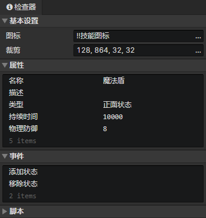

# 文件 - 状态

### 基本设置

- 图标：状态图标，使用<加载图像>指令加载到图像元素中
- 裁剪：可以裁剪状态图标中指定的矩形区域部分

### 状态属性列表

支持布尔值、数值、字符串、字符串(枚举)类型。在窗口->对象属性中修改自定义属性。  
使用<设置布尔值><设置数值><设置字符串>指令读取或修改状态属性。

### 状态事件列表

在事件中访问<事件触发角色>获取状态宿主角色  
在事件中访问<事件触发状态>获取本状态

- 添加状态：当角色通过<改变角色状态>指令添加本状态时触发事件
- 移除状态：当角色通过<改变角色状态>指令移除本状态，或状态持续时间到期时触发事件
- 自定义事件：可通过<调用事件>指令调用自定义事件

### 状态脚本列表

添加Javascript文件来扩展状态