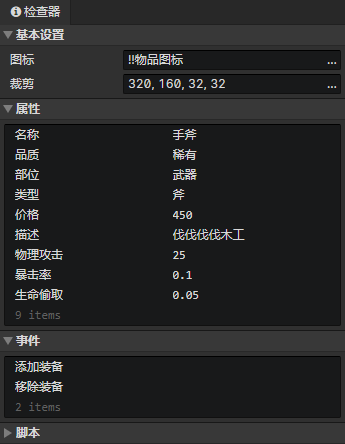

# 文件 - 装备

### 基本设置

- 图标：装备图标，使用<加载图像>指令加载到图像元素中
- 裁剪：可以裁剪装备图标中指定的矩形区域部分

### 装备属性列表

支持布尔值、数值、字符串、字符串(枚举)类型。在窗口->对象属性中修改自定义属性。  
使用<设置布尔值><设置数值><设置字符串>指令读取或修改装备属性。

### 装备事件列表

在事件中访问<事件触发角色>获取装备宿主角色  
在事件中访问<事件触发装备>获取本装备

- 创建事件：装备初始化时执行的事件(执行一次)
- 添加装备：当角色通过<改变角色装备>指令添加本装备时触发事件
- 移除装备：当角色通过<改变角色装备>指令移除本装备时触发事件
- 自定义事件：可通过<调用事件>指令调用自定义事件

### 装备脚本列表

添加Javascript文件来扩展装备