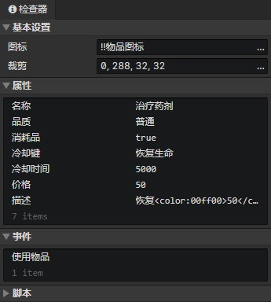

# 文件 - 物品

### 基本设置

- 图标：物品图标，使用<加载图像>指令加载到图像元素中
- 裁剪：可以裁剪物品图标中指定的矩形区域部分

### 物品属性列表

支持布尔值、数值、字符串、字符串(枚举)类型。在窗口->对象属性中修改自定义属性。  
使用<设置布尔值><设置数值><设置字符串>指令读取物品属性，但不能修改物品属性。

### 物品事件列表

在事件中访问<事件触发角色>获取使用物品的角色  
在事件中访问<事件触发物品>获取本物品

- 使用物品：当角色通过<使用物品>指令使用本物品时触发事件
- 自定义事件：可通过<调用事件>指令调用自定义事件

### 物品脚本列表

添加Javascript文件来扩展物品