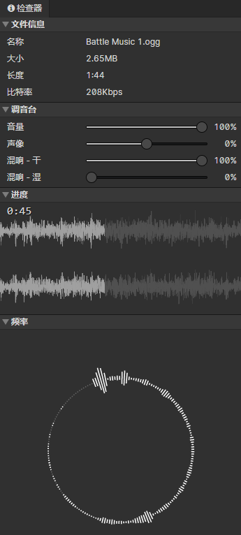

# 文件 - 音频

### 调音台

以下全部为预览声音参数

- 音量：全局音量
- 声像：预览声像，-100% = 只有左声道，+100% = 只有右声道
- 混响 - 干：混响干声音量，越小代表距离声音源越远
- 混响 - 湿：混响湿声音量，模拟封闭环境中的声音反射，越大代表封闭空间越大

### 进度

实时显示音频的播放进度和波形图，点击可以跳转到指定播放时间

### 频率

实时显示正在播放中的声音频率