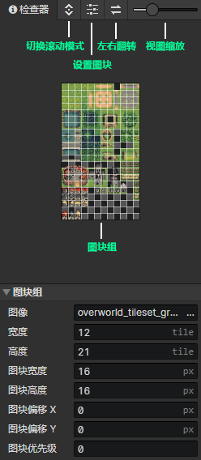
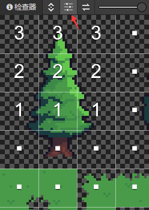
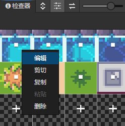
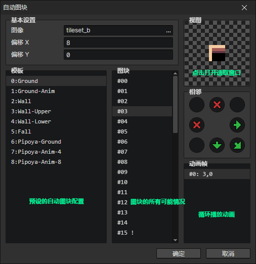
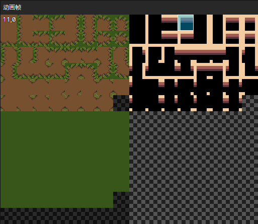

# 文件 - 图块

### 调色板

- 切换滚动模式：开启时，滑动鼠标滚轮让图块组上下滚动，关闭时，放大缩小图块组
- 设置图块：开启时，进入图块组编辑模式
- 水平翻转图块：左右翻转选中的图块，快捷键(F)
- 视图缩放：从左到右分别是25%、50%、100%、200%、400%五个缩放级别

### 图块组

- 图像：选中一个普通图块组的图像(如果是自动图块，这个参数被禁用)
- 宽度：图块组的水平数量
- 高度：图块组的垂直数量
- 图块宽度：单个图块的水平像素数量
- 图块高度：单个图块的垂直像素数量
- 图块偏移X：绘制在场景上的图块水平位置偏移量
- 图块偏移Y：绘制在场景上的图块垂直位置偏移量
- 图块优先级：图块在渲染时的排序优先级，位置在下方的图块总是会遮挡上方的图块，仅当图块绘制在**对象层**瓦片地图中时优先级才会生效
  - 优先级 = -1，表示排序位置向上偏移一个图块的距离
  - 优先级 = 1，表示排序位置向下偏移一个图块的距离

### 编辑图块

点击图块，会出现一个数字，每次点击都会递增1，这个数字代表图块的独立优先级，优先级可以简单地理解为高度。  
如图设置图块优先级，当这棵树被绘制到对象层瓦片地图中时，它会实现正确的遮挡关系：当角色在树的上面时，被它遮挡  
同时按住Shift + 鼠标点击会减少图块的优先级

### 设置自动图块

如果图块组是自动图块类型，可以在编辑模式中一个图块的位置，打开右键菜单->编辑，或者点击空图块的+

### 基本设置

- 图像：自动图块的图像
- 偏移X：对所有图块的水平选取位置偏移，修改后点击右边的视图就能看到效果
- 偏移Y：对所有图块的垂直选取位置偏移，修改后点击右边的视图就能看到效果

### 视图

鼠标点击视图可以打开<选择动画帧>窗口

### 模板列表

预设常用的自动图块配置，可重复使用，可随意调整顺序

- 移动：通过右键菜单->移动，对图块模板中的所有动画帧的选取位置进行偏移

### 图块分支列表

列举了设置图块到场景中时，所有可能的情况

- 设置数量：通过右键菜单->设置数量，调整图块分支的数量
- 设为封面：通过右键菜单->设为封面，将某一个图块分支作为显示封面

### 相邻规则

当设置这个图块到场景中时，按顺序检查每个图块分支，把第一个符合相邻规则条件的图块分支设置到场景中

- 箭头：相邻的图块也是这个自动图块的一个分支
- 十字叉：相邻的图块不是这个自动图块的分支图块
- 空白：不需要判断，两种情况都可以

### 动画帧

如果存在超过1个动画帧，则会循环播放图块动画，动画帧播放间隔可以打开窗口->项目设置->场景，在里面进行修改

- 生成：选中动画帧，通过右键菜单->生成，可以批量生成后续动画帧

### 选择动画帧

选择窗口中的一帧图块，作为当前图块分支的其中一个动画帧  
左边8列图块被覆盖了一层黑色阴影，这是因为设置了基础设置->偏移X = 8，处于黑色阴影中的图块不可选中  
可以把多个自动图块图像放到一张图片中，共享同一个图块模板配置，再通过设置偏移X和偏移Y来选取不同的图块贴图
