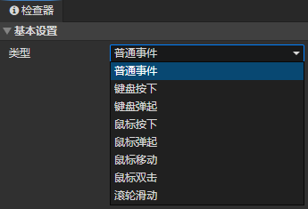
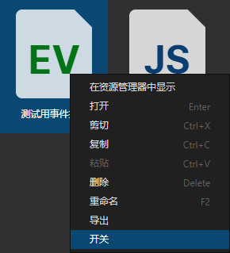

# 文件 - 事件

### 基本设置

类型
  - 普通事件：不会自动执行，通过<调用事件>指令触发事件
  - 键盘按下：键盘按下时触发事件，通过<设置字符串>指令获取按键值，通过条件指令检查按键值。
  - 键盘弹起：键盘弹起时触发事件，通过<设置字符串>指令获取按键值，通过条件指令检查按键值。
  - 鼠标按下：鼠标左键、中键、右键、侧键按下时触发，通过<设置数值>指令获取按键值，通过条件指令检查按键值(0 ~ 4)。
  - 鼠标弹起：鼠标左键、中键、右键、侧键弹起时触发，通过<设置数值>指令获取按键值，通过条件指令检查按键值(0 ~ 4)。
  - 鼠标移动：鼠标在场景中移动时触发事件
  - 鼠标双击：鼠标在场景中连续按下两次，在第二次按下时触发事件
  - 滚轮滑动：鼠标在场景中滚轮向上或向下滑动时触发事件，通过<设置数值>指令获取事件触发鼠标滚轮Y，如果小于0，表示向上滑动，如果大于0，表示向下滑动
  - 自定义事件：可通过插件实现自定义事件的自动触发

:::tip

调用<暂停游戏>指令后，默认全局事件将停止自动触发，
可通过<设置事件>将指定事件设为最高优先级，从而解除暂停游戏时的屏蔽状态

:::

### 开关事件

文件浏览器->事件文件->上下文菜单->开关，可以让事件处于被禁用状态，事件将不会自动触发  
也可以通过<设置事件>指令->启用全局事件/禁用全局事件，开关事件

:::tip

如果有多套玩家控制事件，可以用这种方式切换

:::