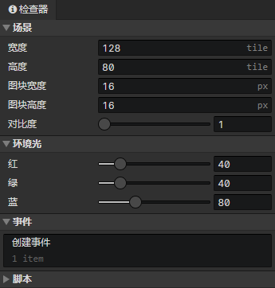

# 场景 - 设置

通过场景工具栏的设置按钮打开此面板

- 宽度：场景的水平网格数量(0 - 512)
- 高度：场景的垂直网格数量(0 - 512)
- 图块宽度：场景网格的宽度(16 - 256)
- 图块高度：场景网格的高度(16 - 256)
- 对比度：场景对象光照合成后的色彩系数（相乘），用来增亮暗光环境下的画面色彩
- 环境光 - 红：原始渲染颜色(红) \* 环境光(红) / 255 \* 对比度 = 最终渲染颜色(红)
- 环境光 - 绿：原始渲染颜色(绿) \* 环境光(绿) / 255 \* 对比度 = 最终渲染颜色(绿)
- 环境光 - 蓝：原始渲染颜色(蓝) \* 环境光(蓝) / 255 \* 对比度 = 最终渲染颜色(蓝)
- 事件：销毁场景后将会停止正在执行的场景事件
  - 创建事件：场景初始化时执行(执行一次)
  - 自动执行：场景加载完成时执行(读取存档时再次执行)
- 脚本：场景扩展脚本
