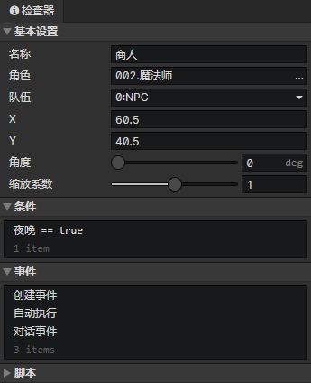

# 场景 - 角色

### 基本设置

- 名称：场景角色的名称，没有实际用处
- 角色：使用一个角色文件作为数据
- 队伍：角色的初始队伍
- X：角色在场景网格中的初始水平位置
- Y：角色在场景网格中的初始垂直位置
- 角度：角色的初始角度，影响角色动画朝向，使用快捷键Ctrl+上/下/左/右可快速设置选中角色的角度
- 缩放系数：整体缩放<角色动画>和<碰撞体积>，与角色文件中的<缩放系数>相乘
  

### 条件列表

在加载场景阶段，当达成条件时才会创建这个角色，场景预设角色可以设置一个永久保存的独立变量

### 角色事件列表

在事件中访问<事件触发角色>获取本角色  
场景角色的事件，会覆盖角色文件中同类型的事件

- 创建事件：角色初始化时执行的事件(执行一次)
- 自动执行：角色出现在场景时自动执行，包括读取存档后
- 碰撞事件：角色与角色发生碰撞时执行，体重如果为0，就不会发生碰撞。在事件中访问<目标角色>获取与本角色碰撞的角色
- 击中触发器：角色被一个触发器击中时，执行本事件，在事件中访问<事件触发器>获取与本角色碰撞的触发器
- 自定义事件：可通过<调用事件>指令调用自定义事件

### 角色脚本列表

添加Javascript文件来扩展角色